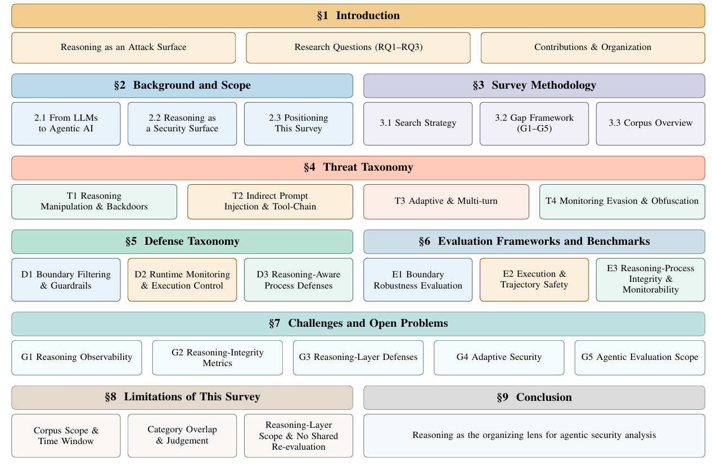

# Securing Agentic Reasoning

**A Survey of Threats, Defenses, and Evaluation for AI Agents**

<!-- Add a paper badge once a preprint or DOI exists, e.g.
[](https://arxiv.org/abs/XXXX.XXXXX)
-->
[](LICENSE)


## 📌 Overview

LLM agents increasingly operate through a persistent reasoning–action loop, planning across multiple steps, invoking tools, processing external content, and maintaining memory. This expands the security surface beyond conventional input–output robustness.

This survey uses reasoning-layer security as the organizing lens connecting threats, defenses, and evaluation. From a structured review of 89 papers (2024–2026), we develop three complementary taxonomies over 71 annotated empirical studies: how adversaries compromise reasoning, where defenses intervene in the agent pipeline, and which evidence layer evaluations observe — boundary behavior, execution trajectories, or reasoning processes.

Across the corpus, defenses and evaluations remain concentrated at the boundary and execution layers, while reasoning-aware mechanisms, adaptive-adversary testing, and validated reasoning-integrity measurement remain limited. None of the 64 evaluation papers combines validated reasoning-integrity measurement, an adaptive adversary, and agentic scope.

This repository provides the supporting annotation data, including paper-level taxonomy assignments, G1–G5 gap coding, and benchmark properties used in the survey.

## 📄 Survey

**Title:** Securing Agentic Reasoning: A Survey of Threats, Defenses, and Evaluation for AI Agents  
**Authors:** Shaima Ahmad Freja, Ferhat Ozgur Catak, Chunming Rong  
**Institution:** University of Stavanger, Norway  
**Status:** Currently under peer review



*Roadmap of the survey. Cluster colours indicate the agent layer a cluster concerns: boundary, execution, and reasoning. T3 is defined by the temporal structure of an attack rather than by a single layer, so it retains the threat colour of §4.*

## ✨ Contributions

- **Threat taxonomy (T1–T4):** classifies reasoning manipulation and backdoors, indirect prompt injection and tool-chain attacks, adaptive and multi-turn attacks, and monitoring evasion and obfuscation.
- **Defense taxonomy (D1–D3):** organizes defenses by intervention point — boundary filtering, runtime execution control, and reasoning-aware process defenses.
- **Evaluation taxonomy (E1–E3):** groups evaluations by observed evidence layer — boundary behavior, execution trajectories, or intermediate reasoning.
- **Gap framework (G1–G5):** identifies gaps in reasoning observability, reasoning-integrity metrics, reasoning-layer defenses, adaptive robustness, and agentic evaluation scope.

## Start here

| Document | What's in it |
|---|---|
| [Threat taxonomy](docs/threat-taxonomy.md) | 31 papers, T1–T4, grouped by attack class |
| [Defense taxonomy](docs/defense-taxonomy.md) | 37 papers, D1–D3, grouped by sub-cluster |
| [Evaluation taxonomy](docs/evaluation-taxonomy.md) | 64 papers, E1–E3, grouped by subgroup |
| [Paper matrix](docs/annotation-matrix.md) | All 71 papers against every coded column |
| [Benchmark inventory](docs/benchmark-inventory.md) | 26 evaluation instruments and their properties |

Every paper is listed by the short name used in the manuscript and linked to its publication.

## Taxonomies

Colour marks the security layer a cluster targets.

**Threats** — 31 papers

| | Cluster | Papers |
|---|---|---|
| 🟦 T1 | Reasoning manipulation and backdoors | 9 |
| 🟧 T2 | Indirect prompt injection and tool-chain attacks | 10 |
| 🟩 T3 | Adaptive and multi-turn attacks | 7 |
| 🟪 T4 | Monitoring evasion and obfuscation | 5 |

**Defenses** — 37 papers

| | Cluster | Papers |
|---|---|---|
| 🟦 D1 | Boundary filtering and guardrails | 12 |
| 🟧 D2 | Runtime agent monitoring and execution control | 12 |
| 🟩 D3 | Reasoning-aware process defenses | 13 |

**Evaluation** — 64 papers

| | Cluster | Papers |
|---|---|---|
| 🟦 E1 | Boundary robustness evaluation | 14 |
| 🟧 E2 | Agent execution and trajectory safety evaluation | 33 |
| 🟩 E3 | Reasoning-process integrity and monitorability evaluation | 17 |

Papers can carry assignments in more than one taxonomy, so these counts overlap and do not sum to 71.

## The gap framework

Five dimensions, coded for every paper. This is what makes the three taxonomies comparable to one another.

| | Gap | Question it asks |
|---|---|---|
| **G1** | Reasoning observability | Is the reasoning process visible to the defense or evaluation at all? |
| **G2** | Reasoning integrity metric | Is there a measure of whether that reasoning is sound? |
| **G3** | Defense capability | Does the defense act on reasoning, or only at the boundary? |
| **G4** | Adaptive robustness | Does it hold against an adversary that adapts? |
| **G5** | Agentic scope | Is it evaluated on real agents, or single-turn prompts? |

Flags render as ● addressed · ◐ partially addressed · ○ present · – not applicable, matching the paper. `PARTIAL` is admissible only in G3 (D) and G4 (D). G1 and G2 are independent: observing a reasoning trace and measuring its integrity are separate capabilities.

## Repository layout

```
.
├── README.md
├── LICENSE
├── figures/
│   └── roadmap.png
└── docs/
    ├── threat-taxonomy.md
    ├── defense-taxonomy.md
    ├── evaluation-taxonomy.md
    ├── annotation-matrix.md
    └── benchmark-inventory.md
```

The documents here are generated from the project's annotation workbooks and carry a do-not-edit banner. The workbooks themselves are not published; researchers wanting them can contact the authors.

## Citation

```bibtex
@misc{freja2026securing,
  title  = {Securing Agentic Reasoning: A Survey of Threats, Defenses,
            and Evaluation for AI Agents},
  author = {Freja, Shaima Ahmad and Catak, Ferhat Ozgur and Rong, Chunming},
  year   = {2026},
  note   = {Under review}
}
```

## License

[CC BY 4.0](LICENSE). You may share and adapt this material, including commercially, with attribution.

Cited papers remain under their own copyright; this repository links to them but does not reproduce them.

## Contact

**Shaima Ahmad Freja** — University of Stavanger, Norway  
[shaima.a.freja@uis.no](mailto:shaima.a.freja@uis.no) · [ORCID 0009-0003-4296-1328](https://orcid.org/0009-0003-4296-1328)

Questions about the annotations or corrections to the coding are welcome — open an issue or get in touch directly.
